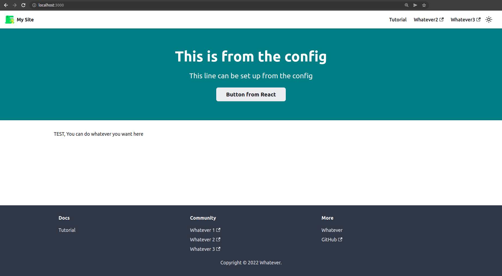

# LABORATORY-DOCUSAURUS



`Docusaurus` is an application open source allowing the user to build, deploy and maintaining a business documentation easily and beautifully. This project is a laboratory for `Docusaurus` where I am testing the different functionnalities and how to use them.

For writting documentation, this application take advantages of **the name of the files and folders** and **markdown file**. This is what have been doing in some of my project but here they manage ot make it more simple and way more complete that my method.

This little project will become my way to go when I have to create a documentation.

## How to setup Docusaurus

For installing, `Docusaurus` to a project, just create a new project named `docs` beside yours using the npx command:

```bash
$ npx create-docusaurus@latest documentation classic --typescript
```

Once installed, dont forget to modify the port of the app inside the `package.json`.

```bash
"start": "docusaurus start --port 4000"
```

In case, you are attaching this project to another project, you can modify the start/dev commands of your project to something like this in order to run your project and the documentation with a single command:

```bash
"start": "react start && npm run start --prefix ./documentation/"
```

## How to use Docusaurus

#### Configuration of the page and sidebar

For creating new page in the documentation, just create new markdown file in the folder `docs`. For adding a new menu, create a folder. The name of the menu would be the name of the folder where a dash represent a space. Be careful, the case is important.

The name of a page will be the set by the title of the first paragraph. It can be override by modifying the value inside the config of the markdown page.

```
sidebar_label: "Hi!"
sidebar_position: 1
id: my-doc-id
title: My document title
description: My document description
slug: /my-custom-url
```

- **sidebar_label**: The title on the sidebar
- **sidebar_position**: The position of the menu in the sidebar
- **id**: The id of the page when calling it
- **title**: The title of the page for SEO
- **description**: The description of the page for SEO
- **slug**: The url of the page

#### Configuration of the homepage

The homepage is set in the `src` folder as a React app. This is a normal react app load inside the template decided by Docusaurus.

#### Configuration of the navigation bar

The top bar is set in the `docusaurus.config.js` file in the themeConfig field. This part is really easy to manipulate for moving the element at the wanted position with an icon...

## Running

For running the application, a single command is necessary

```bash
$ npm run start
```
